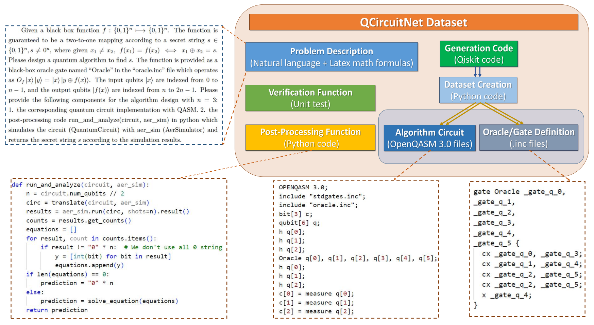

# QCircuitNet Dataset

QCircuitNet is the first benchmark dataset designed to evaluate the capabilities of AI in designing and implementing quantum algorithms from the perspective of programming languages. 

Key features of QCircuitNet include:

1. **Comprehensive Framework**: A general framework which formulates the key features of quantum algorithm design task for Large Language Models, including problem description, quantum circuit codes, classical post-processing, and verification functions.
2. **Wide Range of Quantum Algorithms**: Implementation for a wide range of quantum algorithms from basic primitives to advanced applications, with easy extension to more quantum algorithms.
3. **Validation and Verification Functions**: Automatic validation and verification functions, allowing for iterative evaluation and interactive reasoning without human inspection.
4. **Training Potential**: Promising potential as a training dataset through primitive fine-tuning results.



# 🚀 Benchmarking Workflow

The workflow of our benchmark is illustrated as follows:


# 🌲 Directory Tour

Below is an illustration of the directory structure of QCircuitNet.

```
📂 QCircuitNet/
│
├──📂 Oracle Construction/
│   ├──📂 Quantum Logic Synthesis/
│   │   └── Contains textbook-level and advanced oracles.
│   ├──📂 Problem Encoding/
│       └── Oracles encoding application scenarios.
│
├──📂 Algorithm Design/
│   ├──📂 Quantum Computing/
│   │   └── Contains universal quantum computing algorithms.
│   ├──📂 Quantum Information/
│       └── Includes tasks related to quantum information protocols.
│
├──📂 Random Circuits/
    ├──📂 Clifford/
    │   └── Random circuits with Clifford gate set.
    ├──📂 Universal/
        └── Random circuits with universal gate set.
```

Each subdirectory contains algorithm-specific data. For instance, the directory structure for Simon's algorithm under "Algorithm Design" is as follows:

```
📂 Algorithm Design/
└──📂 Quantum Computing/
    └──📂 simon/                            # All data for the Simon's Problem
        ├──📄 simon-dataset.py              # Dataset creation script
        ├──📄 simon-generation.py           # Qiskit generation code
        ├──📄 simon-post-processing.py      # Post-processing function
        ├──📄 simon-utils.py                # Utility functions for verification
        ├──📄 simon-verification.py         # Verification function
        ├──📄 simon-description.txt         # Problem description
        ├──📄 simon-verification.txt        # Verification results of the data points
        ├──📂 full-circuit/                 # Raw data of quantum circuits
        │   ├──📂 simon-n2/
        │   │   └──📄 simon-n2-s11-k11.qasm # Full circuit for a concrete setting
        │   └──📂 simon-n3/
        │       ├──📄 simon-n3-s011-k001.qasm
        │       ├──📄 simon-n3-s011-k101.qasm
        │       └── ...                   
        └──📂 test-oracle/                  # Extracted oracle definitions
            ├──📂 n2/
            │   ├──📂 trial1/
            │   │   ├──📄 oracle.inc        # Oracle definition as a .inc file
            │   │   └──📄 oracle-info.txt   # Oracle information (such as key strings)
            └──📂 n3/
                ├──📂 trial1/
                │   ├──📄 oracle.inc
                │   └──📄 oracle-info.txt
                ├──📂 trial2/
                │   ├──📄 oracle.inc
                │   └──📄 oracle-info.txt
                └── ...                   
        ├──📄 simon-n2.qasm                 # Algorithm circuit for model output
        ├──📄 simon-n3.qasm                 
        └── ...                           
```

# 📜 Example

In this subsection, we provide concrete examples to illustrate the different components of QCircuitNet. We use the case of Simon's Problem throughout the demonstration to achieve better consistency. For further details, please check the code repository.

### Problem Description

The problem description is provided in a text file named `{algorithm_name}_description.txt`. Below is an example template for Simon's Problem:

```text
Given a black box function f: {0,1}^n → {0,1}^n. The function is guaranteed to be a 
two-to-one mapping according to a secret string s ∈ {0, 1}^n, s ≠ 0^n, where given 
x_1 ≠ x_2, f(x_1) = f(x_2) iff x_1 ⊕ x_2 = s.

Design a quantum algorithm to find the secret string s. The function is provided as a 
black-box oracle gate named "Oracle" in the oracle.inc file, operating as:

    O_f |x⟩|y⟩ = |x⟩ |y ⊕ f(x)⟩

The input qubits |x⟩ are indexed from 0 to n-1, and the output qubits |f(x)⟩ are 
indexed from n to 2n-1. For the algorithm, provide:

1. The quantum circuit implementation using QASM or Qiskit.
2. The post-processing code run_and_analyze(circuit, aer_sim) in Python, which simulates 
   the circuit with AerSimulator and returns the secret string s based on the simulation results.
```

### Generation Code

The following is the Qiskit code to generate a quantum circuit for Simon's Problem. The file is named `{algorithm_name}_generation.py`.

```python
from Qiskit import QuantumCircuit

def simon_algorithm(n, oracle):
    """Generates a Simon algorithm circuit.

    Parameters:
    - n (int): number of qubits
    - oracle: the oracle function

    Returns:
    - QuantumCircuit: the Simon algorithm circuit
    """
    # Create a quantum circuit on 2n qubits
    simon_circuit = QuantumCircuit(2 * n, n)

    # Initialize the first register to the |+> state
    simon_circuit.h(range(n))

    # Append the Simon's oracle
    simon_circuit.append(oracle, range(2 * n))

    # Apply a H-gate to the first register
    simon_circuit.h(range(n))

    # Measure the first register
    simon_circuit.measure(range(n), range(n))

    return simon_circuit
```

### Algorithm Circuit

The OpenQASM 3.0 file stores the quantum circuit for specific settings. Below is an example for Simon's algorithm with `n = 3`. This file is named `{algorithm_name}_n{qubit_number}.qasm`.

```qasm
OPENQASM 3.0;
include "stdgates.inc";
include "oracle.inc";
bit[3] c;
qubit[6] q;
h q[0];
h q[1];
h q[2];
Oracle q[0], q[1], q[2], q[3], q[4], q[5];
h q[0];
h q[1];
h q[2];
c[0] = measure q[0];
c[1] = measure q[1];
c[2] = measure q[2];
```

### Post-Processing Function

This Python function simulates the circuit and derives the final answer to Simon's Problem. The file is named `{algorithm_name}_post_processing.py`.

```python
from sympy import Matrix
import numpy as np
from Qiskit import transpile

def mod2(x):
    return x.as_numer_denom()[0] % 2

def solve_equation(string_list):
    """Solve A^T * X = 0 mod 2 for the null space."""
    M = Matrix(string_list).T
    M_I = Matrix(np.hstack([M, np.eye(M.shape[0], dtype=int)]))
    M_I_rref = M_I.rref(iszerofunc=lambda x: x % 2 == 0)
    M_I_final = M_I_rref[0].applyfunc(mod2)
    
    if all(value == 0 for value in M_I_final[-1, :M.shape[1]]):
        result_s = "".join(str(c) for c in M_I_final[-1, M.shape[1]:])
    else:
        result_s = "0" * M.shape[0]

    return result_s

def run_and_analyze(circuit, aer_sim):
    n = circuit.num_qubits // 2
    circ = transpile(circuit, aer_sim)
    results = aer_sim.run(circ, shots=n).result()
    counts = results.get_counts()
    equations = [list(map(int, result)) for result in counts if result != "0" * n]
    prediction = solve_equation(equations) if len(equations) > 0 else "0" * n
    return prediction
```

### Oracle / Gate Definition

The oracle is defined in the file `oracle.inc`, which is used for algorithm design tasks.

```qasm
gate Oracle q[0], q[1], q[2], q[3], q[4], q[5] {
  cx q[0], q[3];
  cx q[1], q[4];
  cx q[2], q[5];
  cx q[2], q[5];
  x q[3];
}
```

### Oracle Information

This information is stored in the `oracle_info.txt` file and provides additional metadata for the oracle, such as the secret and key strings. Below is an example for Simon's Problem with `n = 3` and test case 2:

```text
Secret string: 100
Key string: 001
```

### Verification Function

The following function checks the correctness of the generated model. The file is named `{algorithm_name}_verification.py`.

```python
from simon_utils import *

def check_model(qasm_string, code_string, n):
    """Check the Simon model."""
    with open(f"test_oracle/n{n}/trial1/oracle.inc", "r") as file:
        oracle_def = file.read()
    full_qasm = plug_in_oracle(qasm_string, oracle_def)
    circuit = verify_qasm_syntax(full_qasm)

    if circuit is None:
        return -1
    
    try:
        exec(code_string, globals())
        aer_sim = AerSimulator()
        total_success, total_fail = 0, 0
        shots = 10

        for t in range(1, 11):
            with open(f"test_oracle/n{n}/trial{t}/oracle_info.txt", "r") as file:
                secret_string = re.search(r"Secret string: ([01]+)", file.read()).group(1)
            circuit = transpile(circuit, aer_sim)
            prediction = run_and_analyze(circuit.copy(), aer_sim)
            if prediction == secret_string:
                total_success += 1
            else:
                total_fail += 1
        return total_success / (total_success + total_fail)

    except Exception as e:
        print(f"Error: {e}")
        return -1
```

### Dataset Creation Script

This script creates the dataset from scratch, generating the circuits, extracting gate definitions, and ensuring dataset validity. The file is named `{algorithm_name}_dataset.py`.

```python
import argparse

def main():
    parser = argparse.ArgumentParser()
    parser.add_argument(
        "-f", "--func", 
        choices=["qasm", "json", "gate", "check"],
        help="Function to call: generate qasm, json, extract gate, or check dataset."
    )
    args = parser.parse_args()

    if args.func == "qasm":
        generate_circuit_qasm()
    elif args.func == "json":
        generate_dataset_json()
    elif args.func == "gate":
        extract_gate_definition()
    elif args.func == "check":
        check_dataset()
```
# 📈 Data Proportion

The following charts provide an overview of the proportion of different data types within the QCircuitNet dataset.

### Algorithm Design

### Oracle Construction

### Random Circuits


# ✂️ Hierarchical Sampling

To provide users with an intuitive view of the dataset content, facilitate display on GitHub pages, and comply with GitHub's policies regarding file number and size, we performed a hierarchical sampling of the dataset. Random sampling was employed to minimize bias inherent in manual selection, thereby maintaining the dataset's diversity and representativeness.

The sampling process is implemented via a function named `hierarchical_sample`, which processes the dataset's root directory and handles subdirectories based on their specific structures. The sampling methodology for each main directory is detailed below:

1. **Algorithm_Design**

   This directory contains two subdirectories: `Quantum_Computing` and `Quantum_Information`.

   a. **Quantum_Computing**

      The `Quantum_Computing` folder includes the following subdirectories:

      - `bernstein_vazirani`
      - `deutsch_jozsa`
      - `generalized_simon_multi`
      - `generalized_simon_ternary`
      - `grover`
      - `phase_estimation`
      - `quantum_fourier_transformation`
      - `simon`

      Each of these subdirectories contains files named `algorithmname_n{}.qasm` (e.g., `bernstein_vazirani_n{}.qasm`), where `algorithmname` matches the folder name. From each subdirectory, we randomly sampled **10 files** to retain.

      Additionally, each subdirectory contains a `test_oracle` folder, which further contains `n{}` subfolders (with varying counts). For each `test_oracle` folder, we randomly sampled **10 `n{}` subfolders** to retain. Within each retained `n{}` folder, if the number of `trial{}` subfolders exceeds 5, we randomly sampled **5 `trial{}` subfolders** to retain and deleted the rest.

   b. **Quantum_Information**

      The `Quantum_Information` folder includes the following subdirectories:

      - `ghz_state`
      - `quantum_key_distribution`
      - `quantum_teleportation`
      - `random_number_generator`
      - `superdense_coding`
      - `swap_test`
      - `w_state`

      - **`ghz_state`**: Contains files named `ghz_state_n{}.qasm` (for `n` from 2 to 133). We randomly sampled **10 files** to retain.

      - **`quantum_key_distribution`**: Contains subdirectories named `qkd_n{}` (for `n` from 20 to 50). We randomly sampled **10 `qkd_n{}` subdirectories** to retain. Each `qkd_n{}` folder contains files named `qkd_n{}_trial{True/False}` with corresponding `.qasm` and `.txt` files (e.g., `qkd_n47_trial1_False.qasm` and `qkd_n47_trial1_False.txt`). For each retained `qkd_n{}` folder, we randomly sampled **5 trials** to retain, where each trial consists of four files:

        - `qkd_n{}_trial{}_True.qasm`
        - `qkd_n{}_trial{}_True.txt`
        - `qkd_n{}_trial{}_False.qasm`
        - `qkd_n{}_trial{}_False.txt`

      - **`quantum_teleportation`**: Contains a `test_oracle` folder with `trial{}` subfolders. We randomly sampled **5 `trial{}` subfolders** to retain.

      - **`random_number_generator`**: Contains files named `qrng_n{}.qasm` (for `n` from 1 to 133). We randomly sampled **10 files** to retain.

      - **`swap_test`**: Contains files named `swap_test_n{}.qasm` (for `n` from 1 to 20). We randomly sampled **10 files** to retain.

        Additionally, there is a `test_oracle` folder containing `n{}` subfolders (number varies). We randomly sampled **10 `n{}` subfolders** to retain. Within each retained `n{}` folder, if the number of `trial{}` subfolders exceeds 5, we randomly sampled **5 `trial{}` subfolders** to retain and deleted the rest.

      - **`w_state`**: Contains files named `w_state_n{}.qasm` (for `n` from 2 to 133). We randomly sampled **10 files** to retain.

        Additionally, there is a `gate_circuit` folder containing files named `w_state_n{}.qasm` (for `n` from 2 to 133). We randomly sampled **10 files** from this folder to retain.

2. **Oracle_Construction**

   This directory contains two subdirectories: `Problem_Encoding` and `Quantum_Logic_Synthesis`.

   a. **Problem_Encoding**

      No sampling was performed on this folder; all contents are retained.

   b. **Quantum_Logic_Synthesis**

      This folder contains the following subdirectories:

      - `bernstein_vazirani`
      - `deutsch_jozsa`
      - `diffusion_operator`
      - `generalized_simon_multi`
      - `generalized_simon_ternary`
      - `grover`
      - `simon`

      Each subdirectory contains subfolders named `algorithmname_n{}` (e.g., `bernstein_vazirani_n{}` for `n` from 2 to 14). For each subdirectory:

      - If the number of `algorithmname_n{}` subfolders exceeds 5, we randomly sampled **5 subfolders** to retain.
      - Within each retained `algorithmname_n{}` subfolder, if the number of items (files or subfolders) exceeds 5, we randomly sampled **5 items** to retain.
      - If the contents of an `algorithmname_n{}` subfolder are themselves subfolders, we applied the same rule recursively: if a subfolder contains more than 5 items, we randomly sampled **5 items** to retain.

3. **Random_Circuits**

   This directory contains two subdirectories: `clifford` and `universal`.

   a. **clifford**

      Contains subdirectories named `clifford_n{}`. We randomly sampled **10 `clifford_n{}` subfolders** to retain.

      - Within each retained `clifford_n{}` folder, there are multiple `I{}` subfolders. We randomly sampled **5 `I{}` subfolders** to retain.
      - Within each retained `I{}` subfolder, we randomly sampled **5 pairs** of `.qasm` and `.txt` files to retain. Each pair consists of the corresponding `.qasm` and `.txt` files (e.g., `clifford_n6_I100_4.qasm` and `clifford_n6_I100_4.txt`).

   b. **universal**

      Contains subdirectories named `universal_n{}`. We randomly sampled **10 `universal_n{}` subfolders** to retain.

      - Within each retained `universal_n{}` folder, there are multiple `I{}` subfolders. We randomly sampled **5 `I{}` subfolders** to retain.
      - Within each retained `I{}` subfolder, we randomly sampled **5 pairs** of `.qasm` and `.txt` files to retain. Each pair consists of the corresponding `.qasm` and `.txt` files (e.g., `universal_n6_I100_4.qasm` and `universal_n6_I100_4.txt`).

By applying this hierarchical sampling procedure, we significantly reduced the dataset size while preserving its diversity and representativeness. This makes the dataset more accessible and manageable for users and ensures compliance with GitHub's file size and number policies.

# 🔊 Download

We host a demo version of the dataset on this GitHub repository to illustrate its structure and provide sample data. For the complete dataset, please download it from [Google Drive](https://drive.google.com/file/d/1Z__0PfOoHT9gz2I_Gc3S1zrbSrUMswqL/view?usp=share_link).

# 😄 Citation and Tech Report
If you use QCirtNet in your research, please cite the following paper:
```
(Fill in the ArXiv BiBTex)
```
